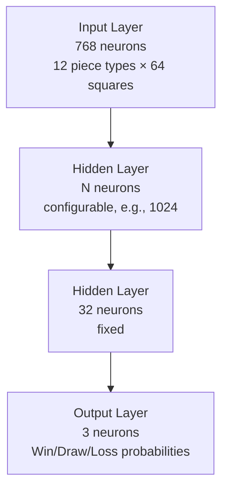
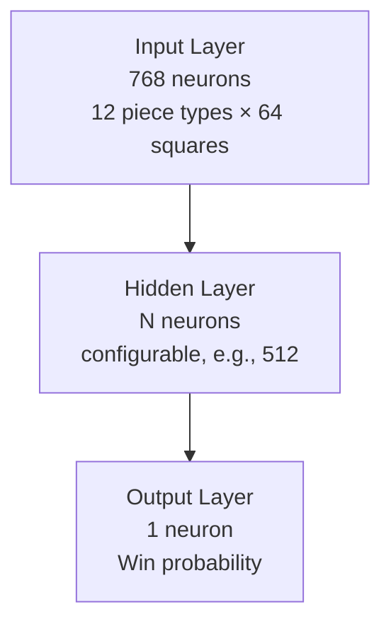

# Shallow Guess

A strong chess engine featuring a shallow neural network for evaluation, trained solely on game results.

## Table of Contents
- [Features](#features)
  - [Board Representation and Move Generation](#board-representation-and-move-generation)
  - [Search Algorithms](#search-algorithms)
  - [Evaluation](#evaluation)
- [Available Models](#available-models)
- [Training](#training)
- [Utility Programs](#utility-programs)
- [Build](#build)
- [Optimized CPU Target Features](#optimized-cpu-target-features)
- [Acknowledgments](#acknowledgments)

## Features

### Board Representation and Move Generation

- **Bitboards with Real-time Bit Scan (No Magic Lookup)**
- **Phased Move Generation**

### Search Algorithms

- **Principal Variation Search**
- **Iterative Deepening**
- **Alpha-Beta Pruning**
- **Aspiration Windows**
- **Quiescence Search**
- **MVV-LVA Sorting**
- **Static Exchange Evaluation (SEE)**
- **History Heuristic**
- **Killer Heuristic**
- **Counter Move Heuristic**
- **Follow-up Move Heuristic**
- **Null Move Pruning with Verification**
- **Late Move Reductions**
- **SEE Pruning**
- **Static Pruning**
- **Zobrist Hashing**
- **Depth-Preferred Transposition Table with Aging**

### Evaluation

- **Partially Quantized Neural Network**
- **Configurable Architecture**
- **Training on Game Results Only**
- **SIMD Optimizations for Inference**

#### Network Architecture

**Coach Model:**


**Player Model:**


The network employs simulated quantization-aware training with post-training dynamic quantization (int8) for input-to-hidden layer weights. The `quantize_weights` utility handles the quantization process.

#### Available Models

The engine includes several pre-trained models which can be found under `resources/models/`.

**Note:** The "Coach-*" models are for intermediate training purposes and should not be used for real-time evaluation (see the Training section).

#### Switching Models

**Note:** For tournament play, use the default model, which offers optimal strength.  

To use a different model, edit `config/network.cfg` and set the `hidden_layer_size`.  

Then rebuild the engine:

```bash
cargo build --release
```

## Training

The neural network is trained on chess game results using a multi-step pipeline that processes PGN data into a training-ready format.

**Data Format:**
- Training data uses compressed run-length encoding to minimize storage
- Features are encoded as `[zero_count]X[zero_count]X...` where `X` represents a 1
- Efficiently compresses sparse 768-dimensional feature vectors
- Player model training uses hybrid data format combining original game results and coach model annotations

For detailed training steps, refer to **[TrainingGuide.md](TrainingGuide.md)**.

## Utility Programs

### Engine Parameter Testing
The `param_test` utility evaluates engine parameters against EPD test suites.

```bash
cargo run --bin param_test [epd_file] [search_time_secs]
```

### Zobrist Key Generation
The `zobrist_key_gen` utility generates optimal hash tables by testing multiple random seeds to minimize collisions.

```bash
cargo run --bin zobrist_key_gen [fen_file_path] [max_seeds_count]
```

### Static Pruning Margin Analysis
The `find_static_pruning_margin` utility analyzes positions to determine optimal static pruning margin by comparing static evaluation scores with 1-ply search results.

```bash
cargo run --bin find_static_pruning_margin [fen_file_path] [stats_batch_count]
```

**Parameters:**
- `fen_file_path`: Input FEN file (CSV format: `fen,result`)
- `stats_batch_count`: Number of positions to process before printing statistics

**Output:**
- Statistics on potential score drops (static_score - search_score)
- Percentile values (p95, p99, p99.9, p99.99) to help set safe pruning margin
- Positions in check or with terminal scores are automatically filtered out

**Example:**
```bash
cargo run --bin find_static_pruning_margin data/filtered_fens.txt 1000
```

## Build

### Pre-compiled Binaries
Starting with version 1.0, pre-compiled binaries are no longer provided due to the complexity of supporting multiple CPU instruction sets. Compilation from source is required.

### Compile from Source

#### Prerequisites
- **Rust Nightly** - Install from [rustup.rs](https://rustup.rs/). Required for portable SIMD support from the standard library.
- **Git** - For cloning the repository
- **Python 3.10+ & PyTorch** - Required only for training new models
- **jq** - For parsing JSON metadata (required by the build script)

**Switch to Rust Nightly:**
```bash
rustup install nightly
rustup default nightly
# Or set nightly only for this project:
rustup override set nightly
```

#### Build Steps

##### Quick Build (Single Binary)
1. **Build the binary:**
   ```bash
   export RUSTFLAGS="-C target-cpu=native"
   cargo build --release
   ```

2. **Run the engine:**
   ```bash
   ./target/release/shallow_guess
   ```

## Optimized CPU Target Features

Since version 1.0, SIMD optimizations using Rust's portable SIMD have been added to support mainstream CPU instruction sets. The build system automatically detects and uses the optimal features available on your CPU.

### Supported Instruction Sets

| Feature | SIMD Types | SIMD Lane Width |
|---------|------------|-----------------|
| **AVX-512F** | `f32x16`, `i16x32` | 16 |
| **AVX2/AVX** | `f32x8`, `i16x16` | 8 |
| **SSE4.1/SSE2** | `f32x4`, `i16x8` | 4 |
| **Default** | `f32x4`, `i16x8` | 4 |

### Building with Specific Features

The `target-cpu=native` flag enables all CPU-specific optimizations available on your system:

```bash
# Build with native CPU optimizations (recommended)
export RUSTFLAGS="-C target-cpu=native"
cargo build --release
```

To build for specific instruction sets, use:

```bash
# AVX-512F only
export RUSTFLAGS="-C target-feature=+avx512f"
cargo build --release

# AVX2 only
export RUSTFLAGS="-C target-feature=+avx2"
cargo build --release

# SSE4.1 only
export RUSTFLAGS="-C target-feature=+sse4.1"
cargo build --release
```

## Acknowledgments

### PGN Extract
[pgn-extract](https://www.cs.kent.ac.uk/people/staff/djb/pgn-extract/) was used to extract training positions from PGN files.

### CCRL (Computer Chess Rating Lists)
50% of the training data for the latest release version was generated from historical 40/15 games obtained from the CCRL website.

### Lichess Elite Database
50% of the training data for the latest release version was generated from games obtained from this database.

### TCEC (Top Chess Engine Championship)
Training data generated from [TCEC](https://tcec-chess.com/) tournament games was used to train previous versions and as validation dataset for the current training.

### Chacha20 by Daniel J. Bernstein
The pseudo-random number generator implements the Chacha20 algorithm created by Daniel J. Bernstein.
