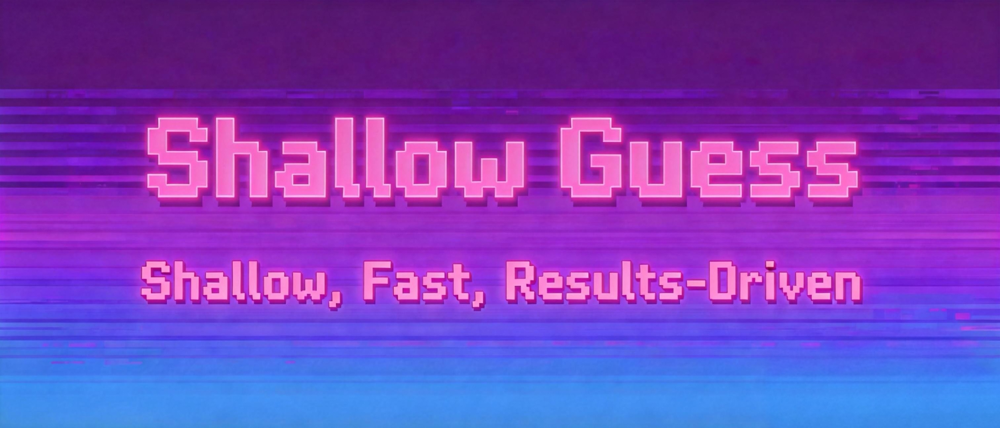
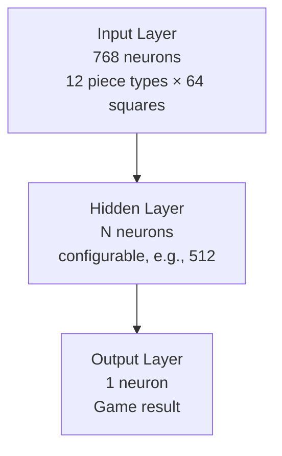

# Shallow Guess

A strong chess engine featuring a shallow neural network for evaluation, 100% trained on game results.



## Table of Contents
- [Features](#features)
  - [Board Representation and Move Generation](#board-representation-and-move-generation)
  - [Search Algorithms](#search-algorithms)
  - [Evaluation](#evaluation)
- [Available Models](#available-models)
- [Training](#training)
- [Utility Programs](#utility-programs)
- [Build](#build)
- [Optimized CPU Target Features](#optimized-cpu-target-features)
- [Acknowledgments](#acknowledgments)

## Features

### Board Representation and Move Generation

- **Bitboards with Real-time Bit Scan (No Magic Lookup)**
- **Phased Move Generation**

### Search Algorithms

- **Principal Variation Search**
- **Iterative Deepening**
- **Alpha-Beta Pruning**
- **Aspiration Windows**
- **Quiescence Search**
- **MVV-LVA Sorting**
- **Static Exchange Evaluation (SEE)**
- **History Heuristic**
- **Killer Heuristic**
- **Counter Move Heuristic**
- **Follow-up Move Heuristic**
- **Null Move Pruning with Verification**
- **Late Move Reductions**
- **Zobrist Hashing**
- **Depth-Preferred Transposition Table with Aging**

### Evaluation

- **Partially-Quantized Neural Network**

#### Network Architecture


```mermaid
graph TD
    A[Input Layer<br/>768 neurons<br/>12 piece types × 64 squares] --> B[Hidden Layer<br/>N neurons<br/>configurable, e.g., 512]
    B --> C[Output Layer<br/>1 neuron<br/>Game result]
```

The model employs simulated quantization-aware training with post-training dynamic quantization (int8) for input-to-hidden layer weights. The `quantize_weights` utility handles the quantization process for the final weights. The quantized weights are embedded into the compiled binary.

#### Pre-trained Weights

The engine includes pre-trained raw weights under `resources/raw_weights/`. These weights are exported from the [ShallowGuessModelTrainer](https://github.com/buildingwheels/ShallowGuessModelTrainer) repository. The build process automatically quantizes these weights and embeds them into the binary.

#### Switching Models

**Note:** For tournament play, use the default model, which offers optimal strength.  

To use a different hidden layer size:

1. Place the raw weights file at `resources/raw_weights/[size].raw_weights`
2. Run the build script:

```bash
./build_scripts/build_weights.sh [size]
```

This updates the config, quantizes the weights, and builds the engine.

## Training

Refer to **[TrainingGuide.md](./TrainingGuide.md)**.

## Utility Programs

### Filter PGN Games
The `filter_pgn` utility filters games from a PGN file based on tag=value criteria:

```bash
cargo run --bin filter_pgn [options] [input.pgn] [output.pgn] [filters]
```

**Options:**
- `--filter-if-missing-tag`: Filter out games that don't have the specified tag

### Engine Parameter Testing
The `param_test` utility evaluates engine parameters against EPD test suites.

```bash
cargo run --bin param_test [epd_file] [search_time_secs] [repeat_count]
```

### Zobrist Key Generation
The `zobrist_key_gen` utility generates optimal hash tables by testing multiple random seeds to minimize collisions.

```bash
cargo run --bin zobrist_key_gen [fen_file_path] [output_path] [max_seeds_count]
```

## Build

### Pre-compiled Binaries
Starting with version 1.0, pre-compiled binaries are no longer provided due to the complexity of supporting multiple CPU instruction sets. Compilation from source is required.

### Compile from Source

#### Prerequisites
- **Rust Nightly** - Install from [rustup.rs](https://rustup.rs/). Required for portable SIMD support from the standard library.

**Switch to Rust Nightly:**
```bash
rustup install nightly
rustup default nightly
# Or set nightly only for this project:
rustup override set nightly
```

#### Build Steps

##### Quick Build (Single Binary)
1. **Build the binary:**
   ```bash
   export RUSTFLAGS="-C target-cpu=native"
   cargo build --release
   ```

2. **Run the engine:**
   ```bash
   ./target/release/shallow_guess
   ```

## Optimized CPU Target Features

Since version 1.0, SIMD optimizations using Rust's portable SIMD have been added to support mainstream CPU instruction sets. The build system automatically detects and uses the optimal features available on your CPU.

### Supported Instruction Sets

| Feature | SIMD Types | SIMD Lane Width |
|---------|------------|-----------------|
| **AVX-512F** | `f32x16`, `i16x32` | 16 |
| **AVX2/AVX** | `f32x8`, `i16x16` | 8 |
| **SSE4.1/SSE2** | `f32x4`, `i16x8` | 4 |
| **Default** | `f32x4`, `i16x8` | 4 |

### Building with Specific Features

The `target-cpu=native` flag enables all CPU-specific optimizations available on your system:

```bash
# Build with native CPU optimizations (recommended)
export RUSTFLAGS="-C target-cpu=native"
cargo build --release
```

To build for specific instruction sets, use:

```bash
# AVX-512F only
export RUSTFLAGS="-C target-feature=+avx512f"
cargo build --release

# AVX2 only
export RUSTFLAGS="-C target-feature=+avx2"
cargo build --release

# SSE4.1 only
export RUSTFLAGS="-C target-feature=+sse4.1"
cargo build --release
```

## Acknowledgments

### PGN Extract
[pgn-extract](https://www.cs.kent.ac.uk/people/staff/djb/pgn-extract/) was used to extract training positions from PGN files.

### CCRL (Computer Chess Rating Lists)
All training data for the latest release version was generated from historical 40/15 games obtained from the CCRL website.

### TCEC (Top Chess Engine Championship)
Validation data was generated from [TCEC](https://tcec-chess.com/) tournament games.

### Chacha20 by Daniel J. Bernstein
The pseudo-random number generator implements the Chacha20 algorithm created by Daniel J. Bernstein.
