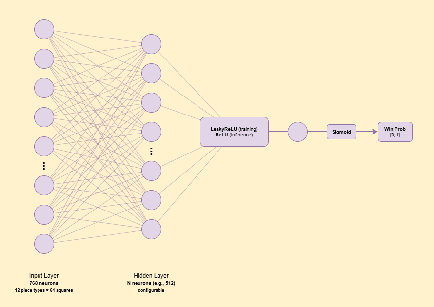

# Shallow Guess

A strong chess engine featuring a shallow neural network for evaluation, 100% trained on game results.


## Features

### Board Representation and Move Generation

- **Bitboards with Real-time Bit Scan (No Magic Lookup)**
- **Phased Move Generation**

### Search Algorithms

- **Principal Variation Search**
- **Iterative Deepening**
- **Alpha-Beta Pruning**
- **Aspiration Windows**
- **Quiescence Search**
- **MVV-LVA Sorting**
- **Static Exchange Evaluation (SEE)**
- **History Heuristic**
- **Killer Heuristic**
- **Counter Move Heuristic**
- **Follow-up Move Heuristic**
- **Null Move Pruning with Verification**
- **Late Move Reductions**
- **Static Pruning**
- **Zobrist Hashing**
- **Depth-Preferred Transposition Table with Aging**

### Evaluation

- **Partially-Quantized Neural Network**

#### Network Architecture



## Build

### Compile from Source (Recommended)

#### Prerequisites
- **Rust Nightly** - Install from [rustup.rs](https://rustup.rs/). Required for portable SIMD support.

**Switch to Rust Nightly:**
   ```bash
   rustup install nightly
   rustup default nightly
   # Or set nightly only for this project:
   rustup override set nightly
   ```

#### Build & Run

1. **Compile for native target and features:**
   ```bash
   # Linux/macOS
   export RUSTFLAGS="-C target-cpu=native"
   # PowerShell
   $env:RUSTFLAGS="-C target-cpu=native"
   # CMD
   set RUSTFLAGS=-C target-cpu=native
   cargo build --release
   ```

2. **Run the engine:**
   ```bash
   ./target/release/shallow_guess
   ```

### Pre-compiled Binaries
Pre-compiled binaries for limited CPU architectures/features are available on the `Releases` page.

## Optimized CPU Target Features

Since version 1.0, SIMD optimizations using Rust's portable SIMD have been added to support mainstream CPU instruction sets. The build system automatically detects and uses the optimal features available on your CPU.

## Training

Refer to **[TrainingGuide.md](./TrainingGuide.md)**.

## Utilities

### Parameterized Testing
The `param_test` utility evaluates engine parameters against EPD test suites.

```bash
cargo run --bin param_test [epd_file] [search_time_secs] [repeat_count]
```

### Zobrist Key Generation
The `zobrist_key_gen` utility generates optimal hash tables by testing multiple random seeds to minimize collisions.

```bash
cargo run --bin zobrist_key_gen [fen_file_path] [output_path] [max_seeds_count]
```

## Acknowledgments

### PGN Extract
[pgn-extract](https://www.cs.kent.ac.uk/people/staff/djb/pgn-extract/) was used to extract training positions from PGN files.

### CCRL (Computer Chess Rating Lists)
Training positions used in both pre-training and fine-tuning were generated from historical 40/15 and 2+1 games obtained from the CCRL website.

### Lichess Elite Database
Training positions used in pre-training were generated from games obtained from this database.

### TCEC (Top Chess Engine Championship)
Validation set was generated from TCEC tournament games.

### Chacha20 by Daniel J. Bernstein
The pseudo-random number generator implements the Chacha20 algorithm created by Daniel J. Bernstein.
