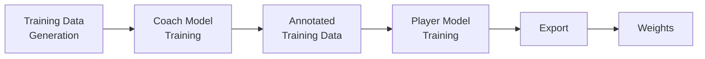

# Training Guide

## Prerequisites

Before starting the training process, ensure you have:
- Python 3.10+
- PyTorch with CUDA support (optional, but recommended for faster training)
- PGN data for training
- Rust toolchain for data processing
- `pgn-extract` tool for extracting FEN positions from PGN files

Install PyTorch via:
```bash
pip install torch numpy
```

## Training Pipeline Overview

The training pipeline follows this sequence:



## Training Process

### 1. Filter FEN Data

First, run the FEN data filtering script to clean and prepare your data:

```bash
cargo run --bin filter_fen_data [input_file] [output_file] [skip_count] [max_count] [skip_terminated_game]
```

**Parameters:**
- `input_file`: Path to the FEN data file generated by `pgn-extract`
- `output_file`: Path where the filtered FEN data will be saved (CSV format: `fen,result`)
- `skip_count`: Number of early moves to skip per game (e.g., 10 to skip opening positions)
- `max_count`: Maximum number of positions to include per game (e.g., 200 to limit game length)
- `skip_terminated_game`: Boolean flag (true/false) to skip games that terminated abnormally

**Example:**
```bash
cargo run --bin filter_fen_data data/extracted_fens.txt data/filtered_fen.txt 10 200 true
```

**Note:** Before running this script, you need to extract FEN positions from your PGN files using the pgn-extract tool:
```bash
pgn-extract -Wfen -o data/extracted_fens.txt data/games.pgn
```

### 2. Generate Training Data

Next, generate the training data from the filtered FEN files:

```bash
cargo run --bin gen_training_data [input_file] [output_file] [batch_size] [optional_log_file]
```

**Parameters:**
- `input_file`: Path to the filtered FEN data file (output from step 1, CSV format: `fen,result`)
- `output_file`: Path where the training data will be saved (text file)
- `batch_size`: Number of positions to buffer before writing to disk (e.g., 10000)
- `optional_log_file`: (Optional) Path to a log file for debugging filtered positions

**Output Format:**
The output file uses a **compressed run-length encoded text format** to minimize storage.
- Features are encoded as: `[number_of_zeros]X[number_of_zeros]X...`
- For example: `12X34X5X...,1.0` means 12 zeros, then a 1, then 34 zeros, then a 1, then 5 zeros, then a 1, with a result of 1.0
- The last field is the game result (0.0, 0.5, or 1.0), adjusted for player color
- This text format compresses the sparse 768-dimensional feature vector efficiently while remaining human-readable.

**Example:**
```bash
cargo run --bin gen_training_data data/filtered_fen.txt data/training_data.txt 10000 data/filtering.log
```

### 3. Train Coach Model

Train the coach model using the generated training data:

```bash
python training_scripts/trainer.py coach [hidden_layer_size] [data_dir] [validation_file] [model_export_path] [max_epochs] [sample_size] [options]
```

### Required Parameters
- `model_type`: Type of model to train - must be "coach" or "player"
- `hidden_layer_size`: Size of the hidden layer in the neural network (e.g., 512)
- `data_dir`: Directory containing the binary training data files (output from step 2)
- `validation_file`: Path to validation data file for monitoring training progress
- `model_export_path`: Path where the trained model will be saved
- `max_epochs`: Maximum number of training epochs (e.g., 100)
- `sample_size`: Number of samples to use for training

### Optional Parameters
- `--batch_size`: Batch size for training (default: 1024)
- `--learning_rate`: Learning rate for optimization (default: 0.001)
- `--print_cycle`: Number of batches between progress updates (default: 100)
- `--export_cycle`: Number of batches between model exports (default: 1000)
- `--existing_pth_file`: Path to existing model file to continue training
- `--training_log_file`: Path to the training log file
- `--enable_diagnostics`: Enable diagnostic output
- `--max_pos_count`: Maximum move count for weight scaling (default: 400)
- `--fine_tuning`: Use fine-tuning mode (SGD with momentum) instead of standard training (AdamW)

### Data Format
The trainer expects text files with the compressed run-length encoded format:
- Features decompressed to 768-dimensional vectors
- Results (0.0, 0.5, 1.0) converted to class indices (0, 1, 2) for classification

**Example:**
```bash
python training_scripts/trainer.py coach 512 data/ data/validation.txt resources/models/ 50 1000000 --batch_size 64 --learning_rate 0.05
```

### 4. Annotate Training Data with Coach Model

Use the trained coach model to annotate the training data:

```bash
python training_scripts/annotate_with_coach.py [coach_model_file] [hidden_layer_size] [input_dir] [output_dir] [options]
```

**Required Parameters:**
- `model_path`: Path to the trained coach model file (.pth file)
- `hidden_layer_size`: Size of the hidden layer (must match coach model)
- `input_dir`: Directory containing input binary training data files (output from step 2)
- `output_dir`: Directory to save annotated binary files

**Optional Parameters:**
- `--batch_size`: Batch size for processing (default: 1024)

**Input/Output Format:**
- **Input**: Text files with compressed run-length encoded features (from `gen_training_data`)
- **Output**: Hybrid format with 3 columns:
  1. Compressed run-length encoded features
  2. Original game result (0.0, 0.5, 1.0)
  3. Coach's win probability (float, 0.0 to 1.0, with 6 decimal places)
  
Example output line: `12X34X5X...,1.0,0.856743`

**Example:**
```bash
python training_scripts/annotate_with_coach.py resources/models/Coach-512.pth 512 data/ data/annotated/
```

### 5. Train Player Model

Train the player model using the annotated training data:

```bash
python training_scripts/trainer.py player [hidden_layer_size] [data_dir] [validation_file] [model_export_path] [max_epochs] [sample_size] [options]
```

### Required Parameters
- `model_type`: Type of model to train (coach or player)
- `hidden_layer_size`: Size of the hidden layer in the neural network (e.g., 512)
- `data_dir`: Directory containing the annotated text training data files (output from step 4)
- `validation_file`: Path to validation data file for monitoring training progress
- `model_export_path`: Path where the trained player model will be saved
- `max_epochs`: Maximum number of training epochs (e.g., 100)
- `sample_size`: Number of samples to use for training

### Optional Parameters
- `--batch_size`: Batch size for training (default: 1024)
- `--learning_rate`: Learning rate for optimization (default: 0.001)
- `--print_cycle`: Number of batches between progress updates (default: 100)
- `--export_cycle`: Number of batches between model exports (default: 1000)
- `--existing_pth_file`: Path to existing model file to continue training
- `--training_log_file`: Path to the training log file
- `--enable_diagnostics`: Enable diagnostic output
- `--max_pos_count`: Maximum move count for weight scaling (default: 400)
- `--fine_tuning`: Use fine-tuning mode (SGD with momentum) instead of standard training (AdamW)
- `--alpha`: Mixing weight for coach vs ground truth loss (default: 0.7) - See "Hybrid Training" section below

### Data Format
The trainer expects text files with the compressed run-length encoded format:
- Features decompressed to 768-dimensional vectors
- Win probabilities (float, 0.0 to 1.0) used directly for regression
- Original game results (0.0, 0.5, 1.0) preserved for hybrid training

### Data Format Variants

**Coach Training Data** (2 columns):
- Column 1: Compressed run-length encoded features
- Column 2: Game result (0.0, 0.5, 1.0)

**Annotated Player Training Data** (3 columns):
- Column 1: Compressed run-length encoded features  
- Column 2: Original game result (0.0, 0.5, 1.0)
- Column 3: Coach's win probability (float, 0.0 to 1.0, 6 decimal places)

**Validation Data** (2 columns):
- Column 1: Compressed run-length encoded features
- Column 2: Game result (0.0, 0.5, 1.0)

## Hybrid Training

The player model uses hybrid training data that combines coach model annotations with original game results. This approach:

1. **Improves generalization** by learning from both expert evaluations (coach) and actual outcomes
2. **Reduces overfitting** to either source by balancing their influence
3. **Enables fine-tuning** of the coach's knowledge with real game results

The loss function combines both targets:
```
total_loss = α * coach_loss + (1 - α) * ground_truth_loss
```

where:
- `α` (default: 0.7) controls the relative weight of coach vs original results
- Higher `α` trusts the coach model more
- Lower `α` trusts actual game results more

**Example:**
```bash
python training_scripts/trainer.py player 512 data/annotated/ data/validation.txt resources/models/ 50 1000000 --batch_size 64 --learning_rate 0.05
```


### 6. Export and Build Weights

After training is complete, export and quantize player model weights:

```bash
./build_scripts/build_weights.sh [hidden_layer_size]
```

**Build Script Parameters:**
- `hidden_layer_size`: Size of hidden layer (must match player model)

**Example:**
```bash
./build_scripts/build_weights.sh 512
```

**Note:** The build script performs the following 5-step process:
1. **Export raw weights**: Uses `export_player_model.py` to extract weights from PyTorch .pth file to CSV format
2. **Quantize weights**: Uses pure Rust `quantize_weights` binary to quantize fc1 weights to int8
3. **Build quantize_weights**: Compiles the quantization binary
4. **Copy quantized weights**: Copies quantized weights to build location with placeholder support
5. **Build project**: Compiles engine with native CPU optimizations

**Model Naming Convention:**
- Coach models are saved as `Coach-{size}.pth` (e.g., `Coach-512.pth`)
- Player models are saved as `Player-{size}.pth` (e.g., `Player-512.pth`)
- The build script automatically detects both naming conventions

## Utility Scripts

### Export Player Model Weights
Exports trained PyTorch player model weights to CSV format for quantization:
```bash
python training_scripts/export_player_model.py [hidden_layer_size] [model_file] [export_file]
```

**Parameters:**
- `hidden_layer_size`: Size of the hidden layer in the model (e.g., 512)
- `model_file`: Path to the trained PyTorch model (.pth file)
- `export_file`: Path where the CSV weights will be saved

### Convert Training Data Format
Converts old training data format to the new compressed run-length encoded format:
```bash
cargo run --bin convert_training_format [input_dir] [output_dir]
```

### Reverse Training Data
Reverses board positions (flips the board) in training data:
```bash
cargo run --bin reverse_training_data [input_file] [output_file]
```

### Blend Training Data
Randomly blends multiple training data files into new mixed files:
```bash
cargo run --bin blend_data [input_path] [output_path] [num_files]
```

### Split Large Training Data
Splits large training data files into smaller parts:
```bash
cargo run --bin split_large_data [input_file] [lines_per_file]
```
