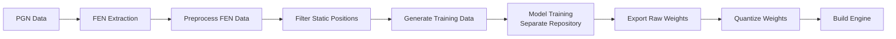

# Training Guide

## Prerequisites

Before starting the training process, ensure you have:
- PGN data for training
- `pgn-extract` tool for extracting FEN positions from PGN files
- Access to the separate model trainer repository: https://github.com/buildingwheels/ShallowGuessModelTrainer

## Training Pipeline Overview

The training pipeline follows this sequence:


```mermaid
graph LR
    A[PGN Data] --> B[FEN Extraction]
    B --> C[Preprocess FEN Data]
    C --> D[Filter Static Positions]
    D --> E[Generate Training Data]
    E --> F[Model Training<br/>Separate Repository]
    F --> G[Export Raw Weights]
    G --> H[Quantize Weights]
    H --> I[Build Engine]
```

## Training Process

### 1. Preprocess FEN Data

First, run the FEN data preprocessing utility to extract FENs and label each FEN with game result and position count:

```bash
cargo run --bin preprocess_fen_data [input_file] [output_file] [skip_count] [max_count]
```

**Parameters:**
- `input_file`: Path to the FEN data file generated by `pgn-extract`
- `output_file`: Path where the preprocessed FEN data will be saved (CSV format: `fen,result,position_count,total_position_count`)
- `skip_count`: Number of early moves to skip per game (e.g., 10 to skip opening positions)
- `max_count`: Maximum number of positions to include per game (e.g., 200 to limit game length)

**Output Format:**
- `fen`: FEN string representation of the position
- `result`: Game result (0.0 = loss, 0.5 = draw, 1.0 = win)
- `position_count`: Current position count
- `total_position_count`: Total number of positions in the game

**Example:**
```bash
cargo run --bin preprocess_fen_data data/extracted_fens.txt data/preprocessed_fen.txt 10 200
```

**Note:** Before running this script, you need to extract FEN positions from your PGN files using the pgn-extract tool:
```bash
pgn-extract -Wfen -o data/extracted_fens.txt data/games.pgn
```

### 2. Filter Non-static FEN Data

Next, filter the preprocessed FEN data to keep only "static" positions (positions that are not in check and have no immediate tactical complications). This step uses an exchange search to determine if positions are static:

```bash
cargo run --bin filter_fen_data [input_file] [output_file] [batch_size]
```

**Parameters:**
- `input_file`: Path to the preprocessed FEN data file (output from step 1)
- `output_file`: Path where the filtered static FEN data will be saved (CSV format: `fen,weighted_result`)
- `batch_size`: Number of positions to buffer before writing to disk (e.g., 10000)

**Example:**
```bash
cargo run --bin filter_fen_data data/preprocessed_fen.txt data/static_fen.txt 10000
```

### 3. Generate Training Data

Next, generate the training data from the filtered static FEN files. This step converts FEN positions with weighted game results to the compressed training format:

```bash
cargo run --bin gen_training_data [input_file] [output_file] [batch_size]
```

**Parameters:**
- `input_file`: Path to the filtered static FEN data file (output from step 2)
- `output_file`: Path where the training data will be saved (text file)
- `batch_size`: Number of positions to buffer before writing to disk (e.g., 10000)

**Output Format:**
The output file uses a **compressed run-length encoded text format** to minimize storage.
- Features are encoded as: `[number_of_zeros]X[number_of_zeros]X...`
- For example: `12X34X5X...,1.0` means 12 zeros, then a 1, then 34 zeros, then a 1, then 5 zeros, then a 1, with a game result of 1.0
- The last field is the **game result** (from the current player's perspective)
- If the current player is BLACK, the result is inverted (1.0 - result)
- This text format compresses the sparse 768-dimensional feature vector efficiently while remaining human-readable.

**Example:**
```bash
cargo run --bin gen_training_data data/static_fen.txt data/training_data.txt 10000
```

### 4. Train Model

Train the model using the new Rust trainer from the separate repository:

```bash
# Clone the trainer repository
git clone https://github.com/buildingwheels/ShallowGuessModelTrainer
cd ShallowGuessModelTrainer

# Build and run the trainer
cargo run --release --bin train [hidden_layer_size] [data_dir] [validation_file] [model_export_path] [max_epochs] [sample_size] [options]
```

**Required Parameters:**
- `hidden_layer_size`: Size of the hidden layer in the neural network (e.g., 512)
- `data_dir`: Directory containing the training data files (output from step 3)
- `validation_file`: Path to validation data file for monitoring training progress
- `model_export_path`: Path where the trained model will be saved (will have `.safetensors` extension added)
- `max_epochs`: Maximum number of training epochs (e.g., 100)
- `sample_size`: Number of files to sample from the training data directory each epoch
- `total_steps`: Total number of training steps

**Optional Parameters:**
- `--batch-size`: Batch size for training (default: 32768)
- `--learning-rate`: Learning rate for optimization (default: 0.01)
- `--existing-model`: Path to existing model file to continue training
- `--warmup-steps`: Number of warmup steps for learning rate scheduler (default: 16)

**Example:**
```bash
cargo run --release --bin train 512 data/training/ data/validation.txt models/Player-512 100 50 50000 --batch-size 32768 --learning-rate 0.01
```

**Note:** The model will be saved as `Player-512.safetensors` in the specified directory.

**Note:** The new Rust trainer replaces the previous PyTorch implementation and provides better performance and integration with the Rust ecosystem.

### 5. Export Raw Weights

After training is complete, you need to export the raw weights from the trained model. The new Rust trainer saves models in a format that needs to be converted to raw weights for quantization:

```bash
# In the ShallowGuessModelTrainer repository
cargo run --release --bin export [hidden_layer_size] [model_file] [export_file]
```

**Parameters:**
- `hidden_layer_size`: Size of hidden layer (must match the trained model)
- `model_file`: Path to the trained model file (output from step 4, with `.safetensors` extension)
- `export_file`: Path where raw weights will be saved

**Example:**
```bash
cargo run --release --bin export 512 models/Player-512.safetensors ../ShallowGuess/resources/raw_weights/512.raw_weights
```

### 6. Quantize Weights and Build Engine

Quantize the raw weights and build the engine with the new model:

```bash
# In the main ShallowGuess repository
./build_scripts/build_weights.sh [hidden_layer_size]
```

**Build Script Parameters:**
- `hidden_layer_size`: Size of hidden layer (must match player model)

**Example:**
```bash
./build_scripts/build_weights.sh 512
```

**Build Script Process:**
1. Updates `config/network.cfg` with the hidden layer size
2. Quantizes fc1 weights to int8 using the `quantize_weights` Rust binary
3. Builds the project with native CPU optimizations

**Model Naming Convention:**
- Raw weights are saved as `[size].raw_weights` in `resources/raw_weights/`
- Quantized weights are saved as `[size].quantized_weights` in `resources/quantized_weights/`

## Utility Scripts

### Generate Quantized Weights Placeholder
Generates placeholder quantized weights for testing or development:

```bash
# In the ShallowGuessModelTrainer repository
cargo run --release --bin gen_quantized_weights_placeholder [hidden_layer_size] [output_file]
```

**Parameters:**
- `hidden_layer_size`: Size of hidden layer
- `output_file`: Path where placeholder quantized weights will be saved

### Filter PGN Games
Filters games from a PGN file based on tag=value criteria:

```bash
cargo run --bin filter_pgn [options] [input.pgn] [output.pgn] [filters]
```

**Positional Parameters:**
- `input.pgn`: Path to the input PGN file
- `output.pgn`: Path where filtered games will be saved
- `filters`: Semicolon-separated tag=value pairs (e.g., `"WhiteElo>2500;BlackElo>2500"`)
  - Supported operators: `=`, `!=`, `>`, `<`

**Options:**
- `--filter-if-missing-tag`: Filter out games that don't have the specified tag (default: games with missing tags are kept)

### Build Validation Dataset
Creates validation datasets by randomly sampling from training data with configurable draw ratio:

```bash
cargo run --bin build_validation_dataset [input_file] [output_file] [sample_count] [draw_ratio]
```

**Parameters:**
- `input_file`: Path to the input training data file
- `output_file`: Path where the validation dataset will be saved
- `sample_count`: Number of samples to randomly select for validation
- `draw_ratio`: Fraction of samples that should be draws (0.0 to 1.0, e.g., 0.3 for 30% draws)

**Example:**
```bash
cargo run --bin build_validation_dataset data/training.txt data/validation.txt 10000 0.3
```

### Blend Training Data
Randomly blends multiple training data files into new mixed files:

```bash
cargo run --bin blend_data [input_path] [output_path] [num_files]
```

### Split Large Training Data
Splits large training data files into smaller parts:

```bash
cargo run --bin split_large_data [input_file] [lines_per_file]
```
