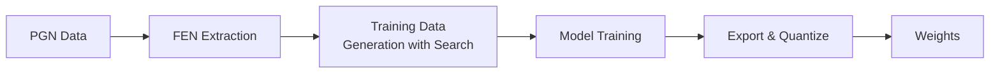

# Training Guide

## Prerequisites

Before starting the training process, ensure you have:
- Python 3.10+
- PyTorch with CUDA support (optional, but recommended for faster training)
- PGN data for training
- `pgn-extract` tool for extracting FEN positions from PGN files

Install PyTorch and the required optimizers via:
```bash
pip install torch pytorch-optimizer
```

## Training Pipeline Overview

The training pipeline follows this sequence:



## Training Process

### 1. Preprocess FEN Data

First, run the FEN data preprocessing utility to extract FENs and label each FEN with game result and move count:

```bash
cargo run --bin preprocess_fen_data [input_file] [output_file] [skip_count] [max_count]
```

**Parameters:**
- `input_file`: Path to the FEN data file generated by `pgn-extract`
- `output_file`: Path where the preprocessed FEN data will be saved (CSV format: `fen,result,move_count`)
- `skip_count`: Number of early moves to skip per game (e.g., 10 to skip opening positions)
- `max_count`: Maximum number of positions to include per game (e.g., 200 to limit game length)

**Output Format:**
- `fen`: FEN string representation of the position
- `result`: Game result (0.0 = loss, 0.5 = draw, 1.0 = win)
- `move_count`: Half-move count in the game (used for result weighting)

**Example:**
```bash
cargo run --bin preprocess_fen_data data/extracted_fens.txt data/preprocessed_fen.txt 10 200
```

**Note:** Before running this script, you need to extract FEN positions from your PGN files using the pgn-extract tool:
```bash
pgn-extract -Wfen -o data/extracted_fens.txt data/games.pgn
```

### 2. Filter Non-static FEN Data

Next, filter the preprocessed FEN data to keep only "static" positions (positions that are not in check and have no immediate tactical complications). This step uses an exchange search to determine if positions are static:

```bash
cargo run --bin filter_fen_data [input_file] [output_file] [batch_size]
```

**Parameters:**
- `input_file`: Path to the preprocessed FEN data file (output from step 1)
- `output_file`: Path where the filtered static FEN data will be saved (CSV format: `fen,weighted_result`)
- `batch_size`: Number of positions to buffer before writing to disk (e.g., 10000)

**Example:**
```bash
cargo run --bin filter_fen_data data/preprocessed_fen.txt data/static_fen.txt 10000
```

### 3. Generate Training Data

Next, generate the training data from the filtered static FEN files. This step converts FEN positions with weighted game results to the compressed training format:

```bash
cargo run --bin gen_training_data [input_file] [output_file] [batch_size]
```

**Parameters:**
- `input_file`: Path to the filtered static FEN data file (output from step 2)
- `output_file`: Path where the training data will be saved (text file)
- `batch_size`: Number of positions to buffer before writing to disk (e.g., 10000)

**Output Format:**
The output file uses a **compressed run-length encoded text format** to minimize storage.
- Features are encoded as: `[number_of_zeros]X[number_of_zeros]X...`
- For example: `12X34X5X...,1.0` means 12 zeros, then a 1, then 34 zeros, then a 1, then 5 zeros, then a 1, with a game result of 1.0
- The last field is the **game result** (from the current player's perspective)
- If the current player is BLACK, the result is inverted (1.0 - result)
- This text format compresses the sparse 768-dimensional feature vector efficiently while remaining human-readable.

**Example:**
```bash
cargo run --bin gen_training_data data/static_fen.txt data/training_data.txt 10000
```

### 4. Train Model

Train the model using the generated training data:

```bash
python training/trainer.py [hidden_layer_size] [data_dir] [validation_file] [model_export_path] [max_epochs] [sample_size] [options]
```

### Required Parameters
- `hidden_layer_size`: Size of the hidden layer in the neural network (e.g., 512)
- `data_dir`: Directory containing the training data files (output from step 3)
- `validation_file`: Path to validation data file for monitoring training progress
- `model_export_path`: Path where the trained model will be saved
- `max_epochs`: Maximum number of training epochs (e.g., 100)
- `sample_size`: Number of samples to use for training

### Optional Parameters
- `--batch_size`: Batch size for training (default: 1024)
- `--learning_rate`: Learning rate for optimization (default: 0.001)
- `--existing_pth_file`: Path to existing model file to continue training
- `--training_log_file`: Path to the training log file (default: `temp/training_log_player_{hidden_layer_size}.log`)
- `--enable_diagnostics`: Enable diagnostic output
- `--fine_tuning`: Use fine-tuning mode (SGD with momentum) instead of standard training (Ranger)
- `--use_pt_format`: Use pre-converted .pt format instead of text format (faster loading)

### Data Format
The trainer expects text files with the compressed run-length encoded format:
- Column 1: Compressed run-length encoded features
- Column 2: Game result (float, 0.0 to 1.0: 0.0 = loss, 0.5 = draw, 1.0 = win)

### Choosing Data Format: Text vs PT

| Format | Pros | Cons | Best For |
|--------|------|------|----------|
| **Text** | Compact storage, human-readable | Slower loading (parsed on-the-fly) | Limited disk space |
| **PT** | Faster training (2-10x faster depending on your CPU,GPU,hard drive) | Larger file size (pre-parsed tensors) | Large disk |

**Text format example:**
```bash
python training/trainer.py 512 data/ data/validation.txt resources/models/ 50 1000000 --batch_size 64 --learning_rate 0.05
```

**PT format example (for faster training):**
First convert your training data:
```bash
python training/convert_to_pt.py data/ data_pt/
```

Then train with the `--use_pt_format` flag:
```bash
python training/trainer.py 512 data_pt/ data_pt/validation.pt resources/models/ 50 1000000 --use_pt_format
```

### Model Architecture
The PlayerModel uses:
- **Input layer**: 768 features (piece-square representation)
- **Hidden layer**: Configurable size with `QuantizedLinear` (quantization-aware training) and `LeakyReLU` activation
- **Output layer**: Single sigmoid output (position evaluation 0-1)

### 5. Export and Build Weights

After training is complete, export and quantize player model weights:

```bash
./build_scripts/build_weights.sh [hidden_layer_size]
```

**Build Script Parameters:**
- `hidden_layer_size`: Size of hidden layer (must match player model)

**Example:**
```bash
./build_scripts/build_weights.sh 512
```

**Build Script Process:**
1. Updates `config/network.cfg` with the hidden layer size
2. Exports raw weights using `export_player_model.py` to CSV format
3. Generates placeholder quantized weights if needed
4. Quantizes fc1 weights to int8 using the `quantize_weights` Rust binary
5. Builds the project with native CPU optimizations

**Model Naming Convention:**
- Models are saved as `Player-{size}.pth` (e.g., `Player-512.pth`)

## Utility Scripts

### Convert Training Data to PT Format
Converts text training data to PyTorch tensor format for faster loading:

```bash
python training/convert_to_pt.py [input_path] [output_path] [--chunk_size SIZE]
```

**Parameters:**
- `input_path`: Input text file or directory
- `output_path`: Output .pt file or directory
- `--chunk_size`: Samples per chunk file (default: 1000000)

### Filter PGN Games
Filters games from a PGN file based on tag=value criteria:

```bash
cargo run --bin filter_pgn [input.pgn] [output.pgn] [filters]
```

**Parameters:**
- `input.pgn`: Path to the input PGN file
- `output.pgn`: Path where filtered games will be saved
- `filters`: Semicolon-separated tag=value pairs (e.g., `"Result=0-1;White=FoxSEE"`)

### Build Validation Dataset
Creates validation datasets by randomly sampling from training data:

```bash
cargo run --bin build_validation_dataset [input_file] [output_file] [sample_count]
```

**Parameters:**
- `input_file`: Path to the input training data file
- `output_file`: Path where the validation dataset will be saved
- `sample_count`: Number of samples to randomly select for validation

### Blend Training Data
Randomly blends multiple training data files into new mixed files:

```bash
cargo run --bin blend_data [input_path] [output_path] [num_files]
```

### Split Large Training Data
Splits large training data files into smaller parts:

```bash
cargo run --bin split_large_data [input_file] [lines_per_file]
```
